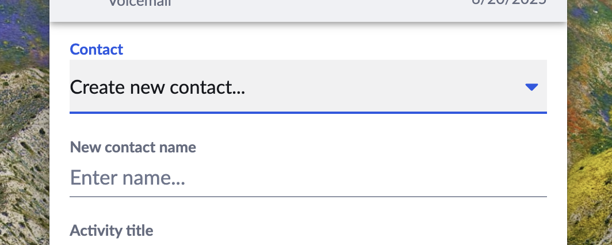

# Loading a contact record

{! docs/developers/beta_notice.inc !}

A critical function performed by the server is looking up a contact record in the target CRM given a phone number, and returning a list of matches for that phone number. In addition, the framework will transmit a list of alternative phone number formats to search for. 

!!! tip "Alternative phone number formats"
    Some CRMs expose a contact search API that is very strict with regards to phone number lookup. For example, if a CRM only supports an EXACT MATCH then searching for an E.164 phone number may not yield any results if the phone number is stored in any other format.
	
	As a workaround, the CRM framework allows users to specify additional phone number formats that they typically store phone numbers in. This list of phone numbers is transmitted to the adapter's server, so that the associated adapter can search for a contact using multiple phone number formats until one is found.

## Searching for a contact by name

When a contact cannot be found via a phone number, users are given the option to search for a contact manually - typically by name. 

<figure markdown>
  
  <figcaption>Searching contacts in a CRM via App Connect</figcaption>
</figure>

When a user elects to do this, the App Connect adapter will be engaged to [search for a name](interfaces/findContactWithName.md) and return a list of possible matches. The user will then select the preferred user, and the call will then be logged against the selected user. 

As a last resort, users will also have the option to create a new contact record. 

<figure markdown>
  
  <figcaption>Creating a contact in a CRM via App Connect</figcaption>
</figure>

When a user selects this option, they will be prompted for a name, and App Connect will engage the adapter to create a contact with that name. The call will then be associated with this newly created contact.

## Implement server endpoints

Within your adapter's `index.js` file, implement the following methods.

* [`createContact`](interfaces/createContact.md)
* [`findContact`](interfaces/findContact.md)
* [`findContactWithName`](interfaces/findContactWithName.md)

## Test

1. Create a new contact on CRM platform and make a call to it
2. In extension, near call record, click `Refresh contact` to check if console prints correct results (`CHECK.3`)

### Multiple contact types

The framework supports multiple contact types at basic levels. Please refer to existing `bullhorn` or `insightly` code implementation and manifest for more details. 
