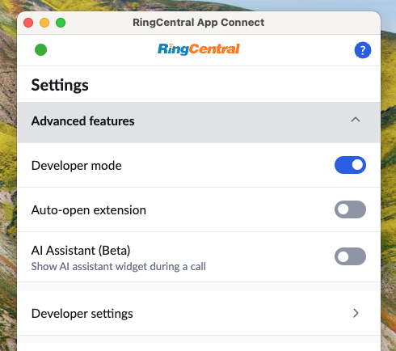
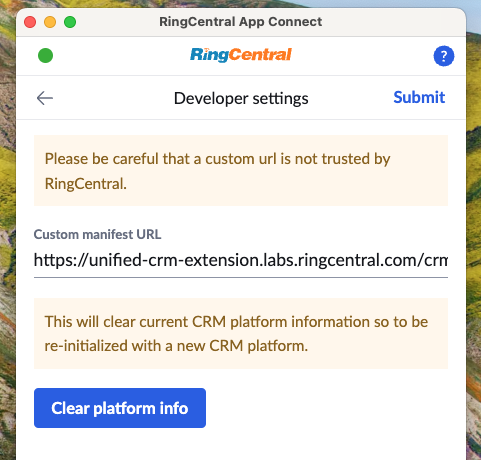

# Getting started building a custom CRM adapter

{! docs/developers/beta_notice.inc !}

Every CRM adapter requires a manifest file which provides developers a way to configure and customize the framework properly for the associated CRM. Via the adapter's manifest, developers can:

* Provide CRM connectivity and authorization details
* Define custom fields for call and SMS logging
* Customize the "Connect to CRM" or authorization screen
* Define custom contact record types/categories

## The App Connect development process

Before we dive into the details, it may be helpful to understand the specific high-level steps you will need to follow as a developer. They are:

1. Create and host an App Connect adapter server
2. Publish your manifest file at a publicly accessible URL
3. Install App Connect 
4. Point App Connect to your custom manifest file URL

When you are done development, your users will only need to follow steps 3 and 4 above. Alternatively, an administrator can set the custom manifest URL across their entire organization using the [managed settings](../users/managed-settings.md) feature. 

## Building an adapter

Let's get started. Begin by [installing](../getting-started.md) App Connect. 

### Fork the framework's repository

We provide developers with a ready-made App Connect adapter server, ready to be customized to the CRM you are integrating with. Bundled with our server are a number of reference implementations of other adapters which you can refer to when building your own. 

To begin, download the adapter framework to your development machine.

    > git clone https://github.com/ringcentral/rc-unified-crm-extension.git
    > cd rc-unified-crm-extension

### Copy your adapter from a template

Copy the contents of the `testCRM` adapter that comes bundled with App Connect to a new folder where your adapter will reside.

    > cp src/adapters/testCRM src/adapters/my-crm-adatper
	
### Start your adapter's server

An App Connect adapter exposes a set of canonicalized APIs that the App Connect client knows how to talk to. In this way, your adapter acts as a broker or proxy between the front-end client (the Microsoft Edge or Google Chrome extension) and the CRM being integrated with. Let's setup and start the sample server bundled with the framework. 

Open up a console and within it, follow these instructions.

1. Install the necessary prerequisites

    ```
	npm i
	```

2. Start [ngrok](https://ngrok.com/)

    ```
	npm run ngrok
	```
	
    Make note of your personalized ngrok URL (referred as `https://xxxx.ngrok.app` below).
	
3. Edit your server's manifest file in the `rc-unified-crm-extension/server` directory

    ```
	cp .env.test .env
	```
	
	Edit `.env` and set `APP_SERVER` equal to your personalized ngrok URL above. 

4. Edit test CRM manifest file in the `rc-unified-crm-extension/src/adapters/testCRM` directory

	Change `serverUrl` in `manifest.json` to `https://xxxx.ngrok.app`

5. Start your server from the `rc-unified-crm-extension/server` directory

    ```
	npm run start
	```

### Turn on developer mode, and configure the client

Next, turn on Developer mode under "Advanced features." This will expose a new menu called "Developer settings."

<figure markdown>
  
  <figcaption>Turning on Developer mode in advanced settings</figcaption>
</figure>

Under "Developer settings" change the "Custom manifest URL" field to the URL of your adapter's manifest file. Your manifest file can typically be accessed in the following way:

> https://xxxx.ngrok.app/crmManifest?platformName=testCRM

The value of the `platformName` query parameter should correspond to your adapter's platform key, highlighted below:

```js hl_lines="9"
{! src/adapters/testCRM/manifest.json [ln:1-11] !}
```

!!! tip "We recommend using a unique value for your adapter's platform key"

<figure markdown>
  
  <figcaption>Change the default manifest URL for App Connect</figcaption>
</figure>

Click "submit."

!!! tip "What to do if saving options doesn't work"
    If saving failed, please check to see if you can manually open the manifest file from your browser. It is possible there is a network policy in effect that is blocking ngrok.

## Next step: edit your manifest file

App Connect is now connected to your custom adapter. From this point you can begin implementing your adapter by doing two things:

1. Customize your [manifest file](manifest.md) to the CRM you are connecting to. 
2. Implement each of the required [interfaces](interfaces/index.md) that App Connect speaks to.

The first thing you will need to implement is a way to connect to your CRM. 

[Implement an authorization layer](auth.md){.md-button}

