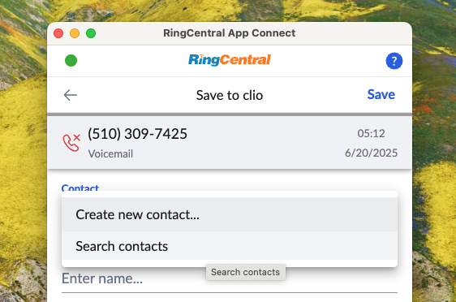

# Resolving logging conflicts

In order for a call to be logged properly, a contact record within the connected CRM must exist and be associated with the phone call. Calls are matched to a contact via the phone number associated with the call.

When no contact can be found associated with a given phone number, or when there are multiple matches for a single phone number, we call that a logging conflict. Logging conflicts must be resolved in order for the call to be logged properly. 

## "No contact found."

If you receive a call from someone whose phone number is not in your CRM, or whose contact record cannot be found, then the call will not be logged. There are a number of ways to resolve this conflict. 

### Create a contact

App Connect will give you the option of creating a new contact whenever a call is logged. Simply select "Create new contact" and you will be prompted to enter a name for the contact. 

We realize that you may want to enter in a lot more information about a contact. So after the call is complete, navigate to the contact record in the CRM and edit the contact to complete the contact creation process. 

<figure markdown>
  
  <figcaption>Creating a placeholder contact in the connected CRM</figcaption>
</figure>

**Tips and best practices**

* App Connect only prompts you for a name. You may want to edit the contact later to augment it with more information about the contact after the call is logged. 
* There is a [call-pop setting](making-calls.md#call-pop) that controls whether App Connect will open a browser tab to the newly created contact to aid you in editing the contact after it is created. 
* Some CRMs require additional records, like a company, be created and associated with a contact. App Connect will often create placeholder objects that you can edit later.
* If the contact exists in your CRM, but App Connect cannot find it, consider editing the contact and updating its phone number to use the E.164 format favored by RingCentral and App Connect. 

!!! tip "What if no contact was found, when a contact is known to exist?"
    Sometimes a contact is not found, even though one knows for a fact that the contact exists. This happens with some CRMs whose search mechanisms are overly strict. You can address this through [advanced settings](phone-number-formats.md), or by searching for the contact by name (see below). 

### Search for a contact

Most App Connect adapters support the ability to search for a contact when one is not able to be found via a phone number. If you adapter supports this capability, you will see a "Search for contact" option in the contact pull-down menu. 

<figure markdown>
  
  <figcaption>Searching contacts in a CRM via App Connect</figcaption>
</figure>

Enter the name of the person to search for, select the desired contact if one is found and App Connect will log the call/SMS against that contact. 

## Multiple possible contacts found

If more than one contact in a CRM shares the same phone number, then multiple contacts are likely to be found. This often happens when communicating with multiple employees from the same company, as it is not uncommon for the incoming phone number of two employees in the same building to present incoming phone numbers of their company's main company number. 

When multiple contacts are found, users are given an opportunity to disambiguate and select the correct contact record. This is done via a pull-down menu on the call logging screen. 

<figure markdown>
  
  <figcaption>Disambiguating between contacts when multiple matches are found in the connected CRM</figcaption>
</figure>

